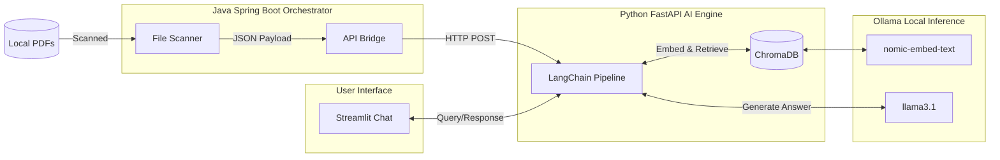
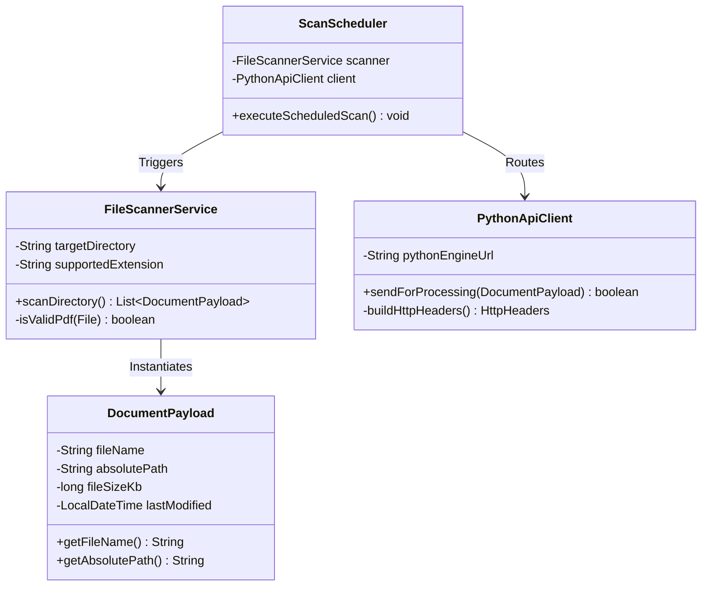

<h1 align="center">🛡️ Enterprise Local RAG Chatbot</h1>

<p align="center">
  
  
  
  
</p>

## Project Overview
This repository contains a **100% locally hosted, air-gapped Retrieval-Augmented Generation (RAG) system** designed to securely index and query sensitive corporate Standard Operating Procedures (SOPs). 

Built as a **polyglot microservices architecture**, the system utilizes Java (Spring Boot) for robust enterprise file orchestration and Python (FastAPI/LangChain) for advanced AI computation and vector mathematics. No data ever leaves the host machine, guaranteeing zero data leakage to public APIs.

---

## 🏗️ High-Level Polyglot Architecture

The system is split into two distinct engines communicating over REST. Java monitors the file system and orchestrates the ingestion pipeline, while Python handles text chunking, embedding, and LLM inference.



---

## 🧩 Java Domain Model & UML

The Java orchestrator is built using strict Object-Oriented Programming (OOP) principles, separating data transfer objects, services, and scheduling components.



---

## Key Features

* **Strict Context Grounding:** The LLM is heavily prompted to prevent hallucinations. Every response explicitly cites the **Source Document Name** and **Section Header**.
* **Automated Ingestion:** The Java scheduler automatically detects new PDFs added to the `data/sops/` directory and streams them to the AI engine.
* **Semantic Context Chunking:** Uses LangChain's `RecursiveCharacterTextSplitter` (1000 tokens, 200 overlap) to ensure paragraphs are not broken mid-sentence.
* **Secure Authentication:** The Streamlit front-end requires local credential authentication before granting access to the SOP knowledge base.

---

## 📂 Directory Structure

```text
RAG Chatbot/
├── data/
│   └── sops/                  # Local dummy PDF storage 
├── docs/                      # Architectural diagrams & specifications
├── evidence/                  # Jira sprint tracking and compliance logs
├── java-orchestrator/         # Spring Boot module (File polling & routing)
├── python-ai-engine/          # FastAPI module (Vector DB & LLM integration)
└── README.md                  # Project documentation

```

---

## 🗺️ Deployment Roadmap

* **Phase 1 (Current):** Local development prototype on Apple Silicon (M1 MacBook Pro) leveraging Apple Metal Performance Shaders (MPS) for hardware acceleration.
* **Phase 2 (Target):** Containerized deployment using **Podman** (rootless containers) on a dedicated Home Server (Dell OptiPlex, 32GB RAM). Remote access will be secured via a **Tailscale** zero-config VPN tunnel.
