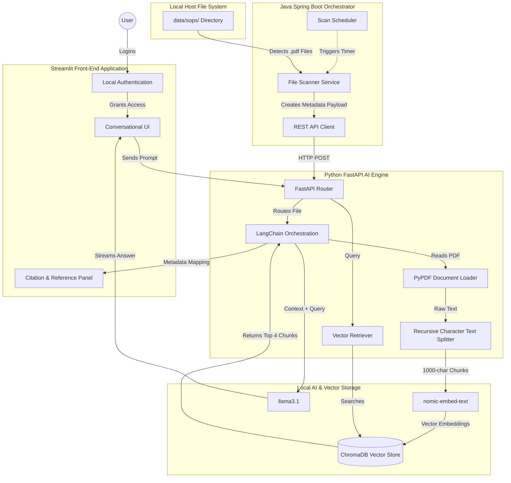
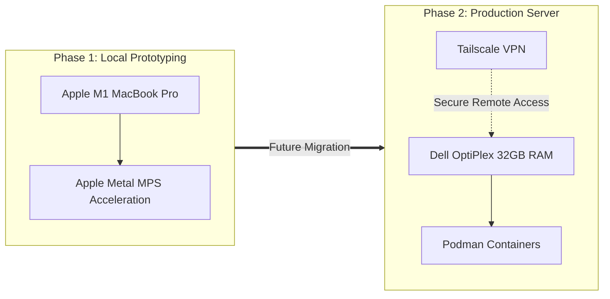

# High-Level System Architecture: Local RAG Chatbot

## System Overview
For this project, I chose to design a polyglot microservices architecture. Instead of cramming everything into one massive application, I am separating the concerns to play to the strengths of different languages. Java handles the enterprise-level orchestration and file system monitoring, while Python handles the heavy AI computation and vector mathematics. 

Crucially, the entire pipeline is air-gapped. No data ever leaves the host machine.

### System Data Flow

## Core Components

### 1. The Java Orchestrator (Spring Boot)

I am using Java to act as the traffic cop for the system.

* **File Scanner & Scheduler:** Runs on a timer to monitor the local `data/sops/` directory for new standard operating procedure PDFs.
* **API Client:** Acts as an internal bridge, packaging the file metadata and triggering HTTP POST requests to the Python microservice when new files are detected.

### 2. The AI Engine (Python FastAPI)

This is where the RAG logic lives. I built this layer using Python to natively integrate with industry-standard AI libraries.

* **Document Loader & Splitter:** Uses LangChain to parse the PDFs and split them into overlapping text chunks (1000 tokens with 200 overlap) to preserve context boundaries.
* **Embedding & Vector Storage:** Converts the text chunks into mathematical vectors and stores them locally using **ChromaDB**.
* **Retrieval Logic:** Performs cosine similarity searches to find the top 4 most relevant chunks when a user asks a question.

### 3. Local Inference (Ollama)

To keep everything local, I am using Ollama as my inference engine.

* **Embedding Model:** `nomic-embed-text` handles the vector generation.
* **Chat Model:** `llama3.1` reads the retrieved context and generates the final conversational response.

### 4. The Front-End (Streamlit)

I built a lightweight web interface using Streamlit. It handles the local user authentication and provides a clean, conversational chat UI that clearly displays the AI's response alongside an expandable panel showing the exact document and section citations.

---

## Deployment Strategy & Hardware Roadmap

* **Phase 1: Local Prototyping (Current)**
  I am currently building and executing the system on my local Apple Silicon (M1 MacBook Pro). This allows me to utilize Apple's Metal Performance Shaders (MPS) for hardware-accelerated local AI inference during the development cycle.
* **Phase 2: Containerization & Server Migration (Future)**
  Once the prototype is fully validated, I plan to containerize the entire architecture. For security and compliance, I will be using **Podman** (which offers rootless, daemonless containers) rather than Docker. The containers will be migrated to my dedicated home server (a Dell OptiPlex with 32GB RAM). Remote access to the server will be secured via a **Tailscale** zero-config VPN tunnel, ensuring the application remains accessible to me off-site while completely invisible to the public internet.
